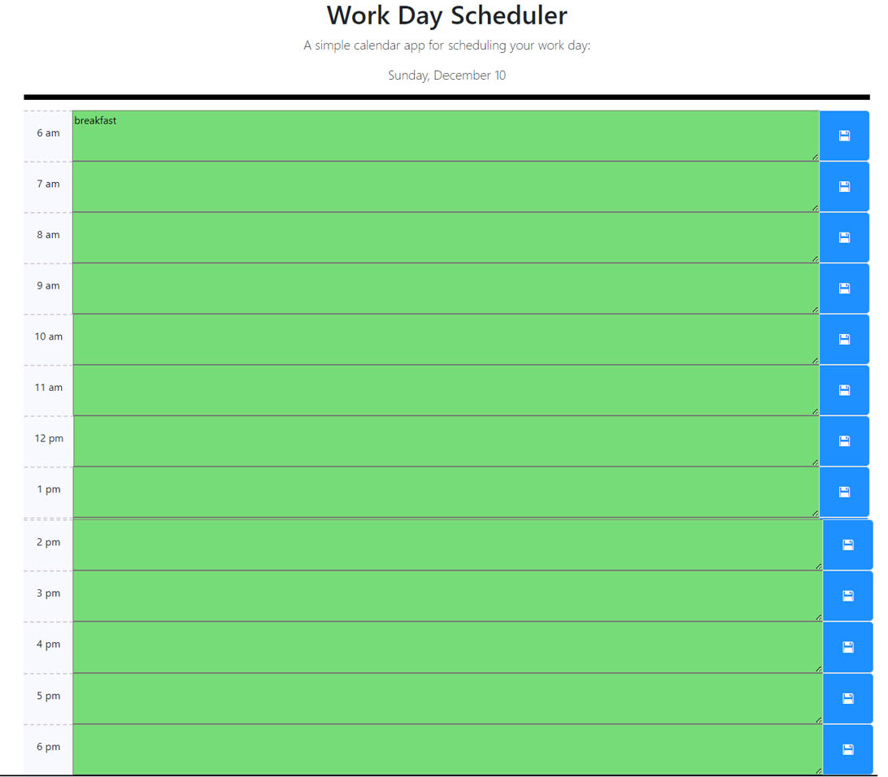

# Quiz Game OSU Bootcamp challenge 5

# Daily Character

## Description

This project challenged me to use javascript to create html elements.

During this project I learned how to:

- work with timers.
- create html elements with Javascript and assign id or classes to them.
- use the event parameter on functions.
- add eventlisteners to html elements and buttons.
- Change styling of elements with javasript
- use localStorage to save data from user input.
- use stringify and parse with json objects.
- declare an object and save to local storage.

## Link to website

https://woestyn101.github.io/mod4Quiz/

## Installation (N/A)

## Usage

The code can be used to review how html pages can be created
width Javascript and enable the user to interact with the page content.

## Screenshot of website

## Credits: Resources used

I used and modified code from the following resources:

## License

MIT
